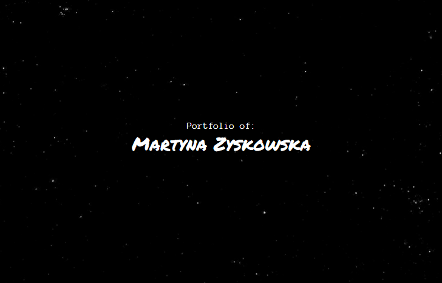
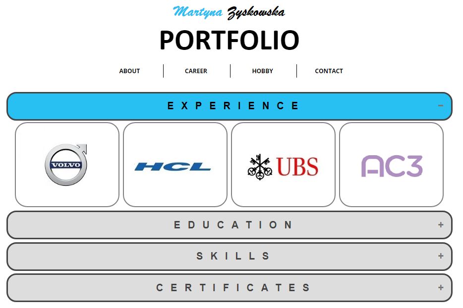

# Website: Portfolio
Personal portfolio website where you can find all information about myself (including work experience, hobbies and contact form).
## Table of Contents
* [General info](#general-info)
* [Screenshots](#screenshots)
* [Technologies](#technologies)
* [Status](#status)
* [Code Examples](#code-examples)
* [Features](#features)
* [Contributing](#contributing)
* [License](#license)
* [Author](#author)
## General Info
The aim of the portfolio website is to provide all basic information about myself for the future employee.
## Screenshots



## Technologies
Project is created with:
- HTML5
- CSS3
- JS ES6
- PHP
## Status
Project is: _in progress_
## Code Examples

```

```

## Features
#### List of features ready and TODOs for future development
* You can easily navigate between different categories
* The site includes different sections:
  - about section
  - hobbies (including gallery)
  - online resume (education, work experience, certificates)
  - contact info and contact form

#### To-do list:
* "Music" section
## Contributing
Contributions to the project library are welcome. Please note the following guidelines before submitting your pull request:
 - Follow [JS coding](https://developer.mozilla.org/bm/docs/Web/JavaScript/Guide) standards
 - Write tests for new functions and added featues
## License
Copyright 2018 Martyna Zyskowska
## Author
Martyna Zyskowska
